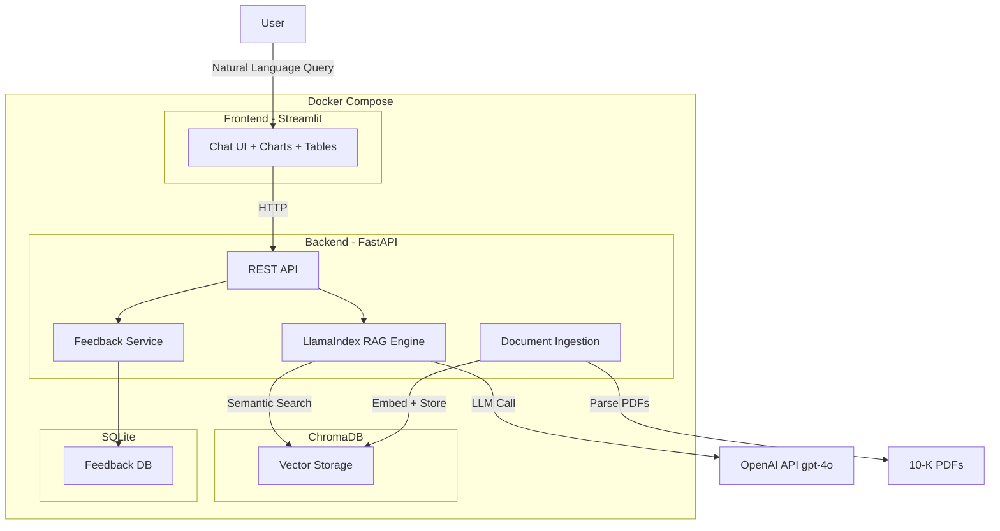

---

# Hackathon Thessaloniki 2026 - Challenge 2: Financial RAG

## Αρχιτεκτονική



## Tech Stack (ολα δωρεαν εκτος OpenAI key)

| Component | Επιλογη | Γιατι |
| --------- | ------- | ----- |

- **Backend:** Python 3.12 + FastAPI -- Async, γρηγορο, αναφερεται στο challenge
- **Frontend:** Streamlit -- Ταχυτατο prototyping, built-in charts/tables/chat UI, ιδανικο για financial data
- **RAG Framework:** LlamaIndex -- Ειδικα σχεδιασμενο για document RAG, εχει built-in PDF readers, chunking strategies, SEC/10-K support
- **Vector Database:** ChromaDB -- Free, open source, official Docker image, εξαιρετικη Python integration
- **Embeddings:** OpenAI `text-embedding-3-small` -- Καλυπτεται απο το παρεχομενο API key, κορυφαια ποιοτητα
- **LLM:** OpenAI `gpt-4o-mini` -- Καλυπτεται απο το key, γρηγορο, φτηνο, καλο reasoning
- **PDF Parsing:** PyMuPDF (pymupdf) -- Free, γρηγορο, αξιοπιστο parsing
- **Feedback Storage:** SQLite -- Built-in στην Python, zero config, δωρεαν
- **Containerization:** Docker + Docker Compose -- Υποχρεωτικο απο το challenge

## Δομη Project

```
Hackathon-RAG/
├── backend/
│   ├── app/
│   │   ├── __init__.py
│   │   ├── main.py              # FastAPI entrypoint
│   │   ├── config.py            # Settings (env vars)
│   │   ├── routers/
│   │   │   ├── query.py         # POST /query - RAG queries
│   │   │   ├── ingest.py        # POST /ingest - trigger indexing
│   │   │   └── feedback.py      # POST /feedback - user feedback
│   │   ├── services/
│   │   │   ├── pdf_parser.py    # PDF loading με PyMuPDFReader
│   │   │   ├── rag_engine.py    # LlamaIndex RAG pipeline
│   │   │   ├── indexer.py       # Document chunking + embedding + ChromaDB storage
│   │   │   └── feedback.py      # Feedback storage logic (SQLite)
│   │   └── models/
│   │       └── schemas.py       # Pydantic models
│   ├── requirements.txt
│   └── Dockerfile
├── frontend/
│   ├── app.py                   # Streamlit UI
│   ├── requirements.txt
│   └── Dockerfile
├── data/                        # 10-K PDFs (curated data)
│   ├── nvidia/
│   │   ├── nvidia_2024.pdf
│   │   └── nvidia_2025.pdf
│   ├── google/
│   │   ├── google-2024.pdf
│   │   └── google_2025.pdf
│   └── apple/
│       ├── apple_2024.pdf
│       └── apple_2025.pdf
├── docker-compose.yml
├── .env                         # OPENAI_API_KEY (gitignored)
├── .gitignore
├── main.py                      # Root entrypoint (helper/pointer)
└── README.md
```

---

## Φασεις Υλοποιησης

### Φαση 1: Docker + Skeleton

- [x] 1.1 Δημιουργια `docker-compose.yml` με 3 services (backend, frontend, chromadb) **(Completed)**
- [x] 1.2 Δημιουργια `backend/Dockerfile` (python:3.12-slim, uvicorn CMD) **(Completed)**
- [x] 1.3 Δημιουργια `frontend/Dockerfile` (python:3.12-slim, streamlit CMD) **(Completed)**
- [x] 1.4 Δημιουργια `backend/requirements.txt` με ολα τα dependencies **(Completed)**
- [x] 1.5 Δημιουργια `frontend/requirements.txt` (streamlit, requests) **(Completed)**
- [x] 1.6 Δημιουργια `.gitignore` **(Completed)**
- [x] 1.7 Hello-world FastAPI backend (`/` και `/health` endpoints) **(Completed)** -> `backend/app/main.py`
- [x] 1.8 Hello-world Streamlit frontend (health check + chat input placeholder) **(Completed)** -> `frontend/app.py`
- [x] 1.9 Verify: τρεξιμο `docker compose up --build` και επιβεβαιωση οτι ολα τα services σηκωνονται χωρις errors **(Completed)**

### Φαση 2: Data Ingestion Pipeline

- [x] 2.1 PDF loader service με PyMuPDFReader **(Completed)** -> `backend/app/services/pdf_parser.py`
- [x] 2.2 Κατεβασμα 10-K PDFs: **(Completed)**
  - [x] 2.2.1 NVIDIA 10-K 2024 (SEC EDGAR) **(Completed)**
  - [x] 2.2.2 NVIDIA 10-K 2025 (SEC EDGAR) **(Completed)**
  - [x] 2.2.3 Google/Alphabet 10-K 2024 (SEC EDGAR) **(Completed)**
  - [x] 2.2.4 Google/Alphabet 10-K 2025 (SEC EDGAR) **(Completed)**
  - [x] 2.2.5 Apple 10-K 2024 (SEC EDGAR) **(Completed)**
  - [x] 2.2.6 Apple 10-K 2025 (SEC EDGAR) **(Completed)**
  - [x] 2.2.7 Δημιουργια subfolders `data/nvidia/`, `data/google/`, `data/apple/` **(Completed)**
- [x] 2.3 Δημιουργια `backend/app/config.py` με environment settings (OPENAI_API_KEY, CHROMA_HOST, CHROMA_PORT, DATA_DIR) **(Completed)**
- [x] 2.4 Δημιουργια `backend/app/services/indexer.py`: **(Completed — e2e test αναμενει API key)**
  - [x] 2.4.1 Φορτωση PDFs μεσω `pdf_parser.load_pdf_documents()` **(Completed)**
  - [x] 2.4.2 Chunking με LlamaIndex `SentenceSplitter` (chunk_size=1024, overlap=200) **(Completed — 625 docs → 796 chunks)**
  - [x] 2.4.3 Προσθηκη metadata σε καθε chunk: `company`, `year`, `doc_type`, `source_file` **(Completed)**
  - [ ] 2.4.4 Δημιουργια embeddings με OpenAI `text-embedding-3-small` *(αναμενει API key)*
  - [ ] 2.4.5 Αποθηκευση vectors στο ChromaDB (μεσω `chromadb` HTTP client -> `CHROMA_HOST:CHROMA_PORT`) *(αναμενει API key + Docker)*

### Φαση 3: RAG Engine + API

- [ ] 3.1 Δημιουργια `backend/app/services/rag_engine.py`:
  - [ ] 3.1.1 Συνδεση στο ChromaDB και δημιουργια `VectorStoreIndex`
  - [ ] 3.1.2 Query engine βασικο: natural language query -> retrieve chunks -> LLM synthesis
  - [ ] 3.1.3 Metadata filtering: δυνατοτητα φιλτραρισματος ανα εταιρεια και/ή ετος
  - [ ] 3.1.4 Sub-query decomposition με `SubQuestionQueryEngine` για multi-step reasoning (π.χ. "Συγκρινε εσοδα NVIDIA 2024 vs 2025")
  - [ ] 3.1.5 Structured response: επιστροφη answer + source_nodes (filename, page, score)
- [ ] 3.2 Δημιουργια `backend/app/models/schemas.py`:
  - [ ] 3.2.1 `QueryRequest` (question: str, companies: list[str] | None, years: list[int] | None)
  - [ ] 3.2.2 `SourceDocument` (filename: str, page: int, score: float, text_snippet: str)
  - [ ] 3.2.3 `QueryResponse` (answer: str, sources: list[SourceDocument])
  - [ ] 3.2.4 `IngestResponse` (status: str, documents_processed: int, chunks_created: int)
  - [ ] 3.2.5 `FeedbackRequest` (query_id: str, rating: str ["up" | "down"], comment: str | None)
  - [ ] 3.2.6 `FeedbackResponse` (status: str, feedback_id: str)
- [ ] 3.3 Δημιουργια `backend/app/routers/`:
  - [ ] 3.3.1 `query.py`: POST `/query` — δεχεται `QueryRequest`, καλει `rag_engine`, επιστρεφει `QueryResponse`
  - [ ] 3.3.2 `ingest.py`: POST `/ingest` — trigger indexing pipeline, επιστρεφει `IngestResponse`
  - [ ] 3.3.3 `feedback.py`: POST `/feedback` — αποθηκευει feedback, επιστρεφει `FeedbackResponse`
- [ ] 3.4 Ενημερωση `backend/app/main.py`:
  - [ ] 3.4.1 Import και register των 3 routers (query, ingest, feedback)
  - [ ] 3.4.2 Προσθηκη CORS middleware (για Streamlit -> FastAPI)
  - [ ] 3.4.3 Startup event: initialize ChromaDB connection + RAG engine

### Φαση 4: Streamlit UI

- [ ] 4.1 Chat interface:
  - [ ] 4.1.1 `st.session_state` για chat history (list of {role, content, sources})
  - [ ] 4.1.2 `st.chat_message()` loop για εμφανιση ολων των μηνυματων
  - [ ] 4.1.3 `st.chat_input()` → POST στο backend `/query` → εμφανιση απαντησης
  - [ ] 4.1.4 Streaming ή spinner κατα τη διαρκεια του query
- [ ] 4.2 Sidebar φιλτρα:
  - [ ] 4.2.1 `st.multiselect` για εταιρειες (NVIDIA, Google, Apple)
  - [ ] 4.2.2 `st.multiselect` για ετη (2024, 2025)
  - [ ] 4.2.3 Περασμα φιλτρων ως parameters στο `/query` request
- [ ] 4.3 Source citations:
  - [ ] 4.3.1 Κατω απο καθε απαντηση, expander με τα source documents (filename, page, relevance score, text snippet)
- [ ] 4.4 Feedback buttons:
  - [ ] 4.4.1 Thumbs up / thumbs down buttons σε καθε απαντηση
  - [ ] 4.4.2 POST στο backend `/feedback` οταν πατηθει button
- [ ] 4.5 Financial data visualization (bonus):
  - [ ] 4.5.1 Αν η απαντηση περιεχει αριθμητικα δεδομενα, εμφανιση σε table ή bar chart

### Φαση 5: Feedback Loop ("Learn from interactions")

- [ ] 5.1 Δημιουργια `backend/app/services/feedback.py`:
  - [ ] 5.1.1 SQLite initialization: δημιουργια table `feedback` (id, query_id, query_text, response_text, rating, comment, timestamp)
  - [ ] 5.1.2 Συναρτηση `save_feedback(feedback_request)` → αποθηκευση στη βαση
  - [ ] 5.1.3 Συναρτηση `get_feedback_stats()` → επιστροφη aggregated stats (total, positive, negative)
  - [ ] 5.1.4 Συναρτηση `get_recent_feedback(limit)` → τελευταια N feedback entries
- [ ] 5.2 Feedback dashboard στο Streamlit:
  - [ ] 5.2.1 Νεα σελιδα ή tab "Analytics" στο sidebar
  - [ ] 5.2.2 Εμφανιση: total queries, positive %, negative %, recent feedback list
- [ ] 5.3 (Bonus) Re-ranking βασει feedback:
  - [ ] 5.3.1 Chunks που σχετιζονται με positive feedback παιρνουν score boost στο retrieval

### Φαση 6: Documentation + Submission

- [x] 6.1 README.md με setup instructions **(Completed)** -> βασικη εκδοση υπαρχει
- [ ] 6.2 Ενημερωση README.md:
  - [ ] 6.2.1 Προσθηκη architecture diagram (Mermaid embedded)
  - [ ] 6.2.2 Προσθηκη API documentation (endpoints, request/response examples)
  - [ ] 6.2.3 Προσθηκη section "How it works" (ingestion -> retrieval -> response pipeline)
- [ ] 6.3 Pitching preparation:
  - [ ] 6.3.1 1-slide summary: τι κανει, ποιο business problem λυνει
  - [ ] 6.3.2 Live demo σεναριο (3-4 example queries που δειχνουν reasoning)
  - [ ] 6.3.3 Architecture slide

---

## Docker Setup (3 services) - Τρεχουσα κατασταση

**docker-compose.yml** — **(Completed)** Τρια services σε internal Docker network:

- `backend` (build: ./backend, port 8000, volumes: ./data -> /app/data, env: OPENAI_API_KEY + CHROMA_HOST + CHROMA_PORT + DATA_DIR)
- `frontend` (build: ./frontend, port 8501, env: BACKEND_URL=http://backend:8000)
- `chromadb` (image: chromadb/chroma:latest, port 8100->8000, named volume: chroma_data)

**backend/Dockerfile** — **(Completed)** python:3.12-slim, pip install, uvicorn CMD

**frontend/Dockerfile** — **(Completed)** python:3.12-slim, pip install, streamlit run CMD

---

## Bug Fixes

- [x] `backend/app/services/pdf_parser.py`: `DATA_DIR` path — fixed με `DATA_DIR` env var (default: `parents[3]/data` locally, `/app/data` via docker-compose) **(Resolved)**

---

## Σημαντικες Σημειωσεις

- **Ολα τα tools ειναι δωρεαν/open-source** εκτος απο OpenAI API (καλυπτεται απο hackathon keys)
- **Μονο official Docker images** (κανονας challenge σελ. 4)
- **ChromaDB εχει official image** στο DockerHub: `chromadb/chroma`
- Τα 10-K PDFs ειναι δημοσια διαθεσιμα στο SEC EDGAR - θεωρουνται "curated data"
