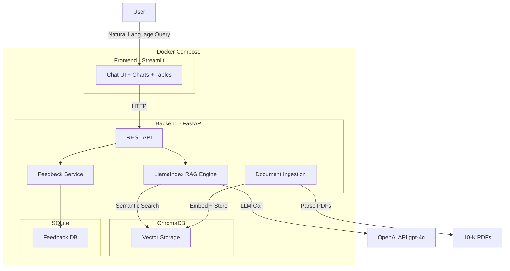

---

# Hackathon Thessaloniki 2026 - Challenge 2: Financial RAG

## Αρχιτεκτονική




## Tech Stack (ολα δωρεαν εκτος OpenAI key)


| Component | Επιλογη | Γιατι |
| --------- | ------- | ----- |


- **Backend:** Python 3.11 + FastAPI -- Async, γρηγορο, αναφερεται στο challenge
- **Frontend:** Streamlit -- Ταχυτατο prototyping, built-in charts/tables/chat UI, ιδανικο για financial data
- **RAG Framework:** LlamaIndex -- Ειδικα σχεδιασμενο για document RAG, εχει built-in PDF readers, chunking strategies, SEC/10-K support
- **Vector Database:** ChromaDB -- Free, open source, official Docker image, εξαιρετικη Python integration
- **Embeddings:** OpenAI `text-embedding-3-small` -- Καλυπτεται απο το παρεχομενο API key, κορυφαια ποιοτητα
- **LLM:** OpenAI `gpt-4o-mini` -- Καλυπτεται απο το key, γρηγορο, φτηνο, καλο reasoning
- **PDF Parsing:** PyMuPDF (pymupdf) -- Free, γρηγορο, αξιοπιστο parsing
- **Feedback Storage:** SQLite -- Built-in στην Python, zero config, δωρεαν
- **Containerization:** Docker + Docker Compose -- Υποχρεωτικο απο το challenge

## Δομη Project

```
Hackathon-RAG/
├── backend/
│   ├── app/
│   │   ├── main.py              # FastAPI entrypoint
│   │   ├── config.py            # Settings (env vars)
│   │   ├── routers/
│   │   │   ├── query.py         # POST /query - RAG queries
│   │   │   ├── ingest.py        # POST /ingest - trigger indexing
│   │   │   └── feedback.py      # POST /feedback - user feedback
│   │   ├── services/
│   │   │   ├── rag_engine.py    # LlamaIndex RAG pipeline
│   │   │   ├── indexer.py       # Document parsing + embedding
│   │   │   └── feedback.py      # Feedback storage logic
│   │   └── models/
│   │       └── schemas.py       # Pydantic models
│   ├── requirements.txt
│   └── Dockerfile
├── frontend/
│   ├── app.py                   # Streamlit UI
│   ├── requirements.txt
│   └── Dockerfile
├── data/                        # 10-K PDFs (curated data)
│   ├── nvidia/
│   │   ├── nvidia_10k_2024.pdf
│   │   └── nvidia_10k_2025.pdf
│   ├── google/
│   │   ├── google_10k_2024.pdf
│   │   └── google_10k_2025.pdf
│   └── apple/
│       ├── apple_10k_2024.pdf
│       └── apple_10k_2025.pdf
├── docker-compose.yml
├── .env                         # OPENAI_API_KEY
└── README.md
```

## Docker Setup (3 services)

**docker-compose.yml** - Τρια services που επικοινωνουν μεσω internal Docker network:

```yaml
version: '3.8'

services:
  backend:
    build: ./backend
    ports:
      - "8000:8000"
    volumes:
      - ./data:/app/data
    environment:
      - OPENAI_API_KEY=${OPENAI_API_KEY}
      - CHROMA_HOST=chromadb
      - CHROMA_PORT=8000
    depends_on:
      - chromadb

  frontend:
    build: ./frontend
    ports:
      - "8501:8501"
    environment:
      - BACKEND_URL=http://backend:8000
    depends_on:
      - backend

  chromadb:
    image: chromadb/chroma:latest
    ports:
      - "8100:8000"
    volumes:
      - chroma_data:/chroma/chroma

volumes:
  chroma_data:
```

**backend/Dockerfile:**

```dockerfile
FROM python:3.11-slim
WORKDIR /app
COPY requirements.txt .
RUN pip install --no-cache-dir -r requirements.txt
COPY . .
CMD ["uvicorn", "app.main:app", "--host", "0.0.0.0", "--port", "8000"]
```

**frontend/Dockerfile:**

```dockerfile
FROM python:3.11-slim
WORKDIR /app
COPY requirements.txt .
RUN pip install --no-cache-dir -r requirements.txt
COPY . .
CMD ["streamlit", "run", "app.py", "--server.port=8501", "--server.address=0.0.0.0"]
```

## Φασεις Υλοποιησης

### Φαση 1: Docker + Skeleton (πρωτη προτεραιοτητα)

1. Στησιμο `docker-compose.yml` με τα 3 services
2. Hello-world FastAPI backend + Streamlit frontend
3. Verify: `docker-compose up` τρεχει χωρις errors

### Φαση 2: Data Ingestion Pipeline

1. Κατεβασμα 10-K PDFs απο SEC EDGAR (δωρεαν, public) για NVIDIA, Google, Apple (2024-2025)
2. PDF parsing με PyMuPDF μεσω LlamaIndex `SimpleDirectoryReader`
3. Chunking με `SentenceSplitter` (chunk_size=1024, overlap=200)
4. Metadata σε καθε chunk: εταιρεια, ετος, τυπος εγγραφου, section
5. Embedding με OpenAI `text-embedding-3-small` και αποθηκευση σε ChromaDB

### Φαση 3: RAG Engine + API

1. LlamaIndex `VectorStoreIndex` πανω στο ChromaDB
2. Query engine με metadata filtering (π.χ. φιλτραρισμα ανα εταιρεια/ετος)
3. FastAPI endpoints: `/query`, `/ingest`, `/feedback`
4. **Reasoning capability:** Multi-step queries (π.χ. "Συγκρινε τα εσοδα NVIDIA 2024 vs 2025")
  - Sub-query decomposition με LlamaIndex `SubQuestionQueryEngine`
5. Structured output: JSON responses με sources, confidence, extracted entities

### Φαση 4: Streamlit UI

1. Chat interface (st.chat_message) για natural language queries
2. Sidebar με φιλτρα (εταιρεια, ετος)
3. Εμφανιση sources/citations κατω απο καθε απαντηση
4. Like/Dislike buttons σε καθε response
5. Financial data visualization (charts για συγκρισεις αν ειναι εφικτο)

### Φαση 5: Feedback Loop ("Learn from interactions")

1. SQLite table: query, response, feedback (thumbs up/down), timestamp
2. Endpoint POST `/feedback` αποθηκευει feedback
3. Dashboard στο Streamlit που δειχνει feedback stats
4. Bonus: χρηση feedback για re-ranking (boost chunks με θετικο feedback)

### Φαση 6: Documentation + Submission

1. README.md με setup instructions (`docker-compose up`)
2. Architecture diagram (Mermaid)
3. Pitching preparation

## Σημαντικες Σημειωσεις

- **Ολα τα tools ειναι δωρεαν/open-source** εκτος απο OpenAI API (καλυπτεται απο hackathon keys)
- **Μονο official Docker images** (κανονας challenge σελ. 4)
- **ChromaDB εχει official image** στο DockerHub: `chromadb/chroma`
- Τα 10-K PDFs ειναι δημοσια διαθεσιμα στο SEC EDGAR - θεωρουνται "curated data"

