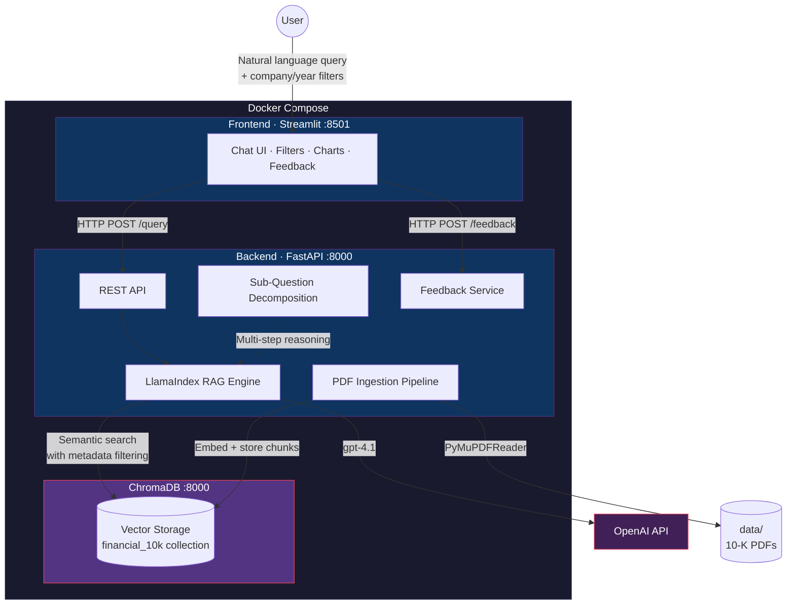

# PageIndex RAG — 10-K Financial Document Analysis

A Retrieval-Augmented Generation system that ingests SEC 10-K annual reports (NVIDIA, Alphabet/Google, Apple), indexes them at page-level granularity, and answers natural-language financial questions with **grounded, source-cited, explainable responses**.

Built for **Netcompany Hackathon Thessaloniki 2026** — Challenge 2: AI-Powered Knowledge Base.

## Architecture



## Key Features

- **Intelligent Retrieval** — semantic vector search with metadata filtering by company and fiscal year
- **Explainable Responses** — every answer includes source citations (filename, page number, relevance score, text snippet)
- **Multi-Step Reasoning** — sub-question decomposition for comparative queries (e.g. *"Compare NVIDIA vs Google revenue"*)
- **Financial Visualization** — automatic table and bar chart rendering when responses contain numerical data
- **API Usage Tracking** — token counts and estimated cost via `/usage`; displayed in Streamlit sidebar
- **User Feedback** — thumbs up/down on every response for continuous improvement signals
- **Graceful Degradation** — MockLLM/MockEmbedding fallback when no OpenAI API key is configured

## Tech Stack

| Layer | Technology | Role |
|-------|-----------|------|
| Backend | Python 3.12 + FastAPI | Async REST API |
| RAG Framework | LlamaIndex | Document ingestion, chunking, retrieval, synthesis |
| LLM | OpenAI `gpt-4.1` | Answer generation from retrieved context |
| Embeddings | OpenAI `text-embedding-3-small` | Dense vector generation (1536 dims) |
| Vector Database | ChromaDB | Persistent vector storage with metadata index |
| PDF Parsing | PyMuPDF (`pymupdf`) | Page-level text extraction |
| Frontend | Streamlit | Chat interface with filters, citations, charts |
| Feedback Storage | SQLite | Zero-config feedback persistence |
| Containerization | Docker Compose | Three-service orchestration |

## Data Corpus

Six 10-K annual reports from SEC EDGAR, covering three companies across two fiscal years:

| Company | FY 2024 | FY 2025 |
|---------|---------|---------|
| NVIDIA | `nvidia_2024.pdf` | `nvidia_2025.pdf` |
| Alphabet (Google) | `google-2024.pdf` | `google_2025.pdf` |
| Apple | `apple_2024.pdf` | `apple_2025.pdf` |

All documents are publicly available and committed in the `data/` directory.

---

## Quick Start

| Run mode | Command |
|----------|---------|
| **Docker (all services)** | `docker compose up --build` → http://localhost:8501 |
| **Streamlit (local)** | ChromaDB + backend + `streamlit run app.py` in `frontend/` |
| **Terminal only** | ChromaDB + backend + `curl -X POST .../query` |

### Prerequisites

- [Docker Desktop](https://www.docker.com/products/docker-desktop/) installed and running
- An OpenAI API key (provided by hackathon organizers)

Verify Docker is available:

```bash
docker --version
docker compose version
```

### 1. Clone the repository

```bash
git clone <repo-url>
cd Hackathon-RAG
```

### 2. Create the `.env` file

Create a `.env` file in the project root:

```
OPENAI_API_KEY=sk-your-key-here
```

> The `.env` file is gitignored and never committed. Each team member creates it locally.

### 3. Start the system

```bash
docker compose up --build
```

The first build downloads base images and installs dependencies (3-5 minutes). Subsequent starts are faster.

### 4. Verify all services

| Service | URL | Expected |
|---------|-----|----------|
| Backend | http://localhost:8000 | `{"message": "Financial RAG Backend is running"}` |
| Frontend | http://localhost:8501 | Streamlit Chat UI |
| ChromaDB | http://localhost:8100 | ChromaDB API root |

### 5. Ingest the documents

Before querying, trigger the ingestion pipeline to parse, chunk, embed, and store all 10-K documents:

```bash
curl -X POST http://localhost:8000/ingest
```

This processes all 6 PDFs, creates ~800 chunks with metadata, generates embeddings, and stores them in ChromaDB. Takes 2-5 minutes depending on hardware.

### 6. Start asking questions

Open http://localhost:8501 and ask questions like:

- *"What was NVIDIA's total revenue in fiscal year 2024?"*
- *"Compare Apple and Google's net income for 2025."*
- *"What are the main risk factors mentioned in NVIDIA's 10-K?"*
- *"How did Alphabet's advertising revenue change between 2024 and 2025?"*

Use the sidebar filters to narrow results by company and year. Enable **Sub-question decomposition** for complex comparative queries (see [Complex Queries & Sub-Questions](#complex-queries--sub-questions)).

### Stopping the system

Press **Ctrl+C** in the terminal, or run:

```bash
docker compose down
```

Data persists in the `chroma_data` Docker volume across restarts. To fully reset:

```bash
docker compose down -v
```

---

## Complex Queries & Sub-Questions

For **comparative or multi-part questions**, enable **Sub-question decomposition** in the sidebar (Streamlit) or set `use_sub_questions: true` in the API. The system breaks your question into simpler sub-questions, retrieves context for each, then synthesizes a single answer.

| Query type | Example | Sub-questions? |
|------------|---------|----------------|
| Simple fact | *"What was NVIDIA's revenue in 2024?"* | No |
| Comparison (2+ companies) | *"Compare NVIDIA vs Google revenue for 2025"* | **Yes** |
| Multi-year trend | *"How did Apple's net income change from 2024 to 2025?"* | **Yes** |
| Cross-company + year | *"Which company had higher R&D spend in 2024: NVIDIA or Alphabet?"* | **Yes** |

**Example (API):**

```bash
curl -X POST http://localhost:8000/query \
  -H "Content-Type: application/json" \
  -d '{
    "question": "Compare NVIDIA and Google total revenue for 2024 and 2025",
    "use_sub_questions": true
  }'
```

The response includes a **Reasoning steps** expander showing each sub-question and its answer before the final synthesis.

---

## How It Works

### Ingestion Pipeline

```
10-K PDFs (data/nvidia/, data/google/, data/apple/)
        │
        ▼
  PyMuPDFReader — per-page text extraction
        │
        ▼
  SentenceSplitter — chunk_size=1024, overlap=200
        │
        ▼
  Metadata Enrichment — company, year, doc_type, source_file
        │
        ▼
  OpenAI text-embedding-3-small — 1536-dim dense vectors
        │
        ▼
  ChromaDB — persistent storage with metadata index
```

Each PDF page becomes one or more chunks. Every chunk carries metadata (company name, fiscal year, document type, source filename) enabling precise filtered retrieval.

### Query Pipeline

```
User question + optional filters (company, year)
        │
        ▼
  Metadata Filter Construction — FilterOperator.IN + FilterCondition.AND
        │
        ▼
  Semantic Retrieval — top-5 chunks from ChromaDB
        │
        ▼
  (Optional) Sub-Question Decomposition — breaks complex queries into sub-questions
        │
        ▼
  LLM Synthesis (gpt-4.1) — grounded answer from retrieved context only
        │
        ▼
  Structured Response — answer + source citations (filename, page, score, snippet)
```

---

## API Reference

### Endpoints

| Method | Path | Description |
|--------|------|-------------|
| `GET` | `/` | Health message |
| `GET` | `/health` | Health check (`{"status": "ok"}`) |
| `GET` | `/usage` | API token usage and estimated cost |
| `POST` | `/query` | Execute a RAG query with optional filters |
| `POST` | `/ingest` | Trigger the document ingestion pipeline |
| `POST` | `/feedback` | Submit user feedback on a response |
| `POST` | `/shutdown` | Persist data before stopping containers |

### `POST /query`

Ask a natural-language question with optional company/year filters.

**Request:**

```json
{
  "question": "What was NVIDIA's total revenue in 2024?",
  "companies": ["nvidia"],
  "years": [2024],
  "use_sub_questions": false
}
```

**Response:**

```json
{
  "answer": "NVIDIA's total revenue for fiscal year 2024 was $60.9 billion...",
  "sources": [
    {
      "filename": "nvidia_2024.pdf",
      "page": 45,
      "score": 0.8721,
      "text_snippet": "Total revenue for the fiscal year ended January 28, 2024..."
    }
  ]
}
```

**cURL example:**

```bash
curl -X POST http://localhost:8000/query \
  -H "Content-Type: application/json" \
  -d '{"question": "What was NVIDIA total revenue in 2024?", "companies": ["nvidia"], "years": [2024]}'
```

### `POST /ingest`

Triggers the full ingestion pipeline: PDF parsing, chunking, embedding, and ChromaDB storage. Skips if documents are already indexed unless `force: true` is sent.

**Request (optional):**

```json
{"force": true}
```

**Response:**

```json
{
  "status": "ok",
  "documents_processed": 6,
  "chunks_created": 796,
  "existing_chunks": 0
}
```

### `POST /feedback`

Submit a thumbs-up or thumbs-down rating on a query response.

**Request:**

```json
{
  "query_id": "q-001",
  "rating": "up",
  "comment": "Accurate revenue figure with correct source citation"
}
```

**Response:**

```json
{
  "status": "ok",
  "feedback_id": "adcf3f7e-cd91-4b2a-8f1e-..."
}
```

---

## Environment Variables

| Variable | Default | Description |
|----------|---------|-------------|
| `OPENAI_API_KEY` | `""` | OpenAI API key. Without a valid `sk-` key, the system falls back to MockLLM/MockEmbedding. |
| `CHROMA_HOST` | `localhost` | ChromaDB hostname. Set to `chromadb` inside Docker. |
| `CHROMA_PORT` | `8100` | ChromaDB port. Set to `8000` inside Docker (internal port). |
| `DATA_DIR` | (auto-detected) | Path to the `data/` directory containing 10-K PDFs. Set to `/app/data` in Docker. |
| `BACKEND_URL` | `http://localhost:8000` | Backend URL used by the Streamlit frontend. Set to `http://backend:8000` in Docker. |

All environment variables are configured automatically in `docker-compose.yml`. The only manual step is creating the `.env` file with your OpenAI API key.

---

## Running Without Docker

### Option A: Streamlit UI (recommended)

1. **Start ChromaDB** (required for vector storage):

   ```bash
   docker run -d -p 8100:8000 -v chroma_data:/data chromadb/chroma:latest
   ```

2. **Start the backend:**

   ```bash
   cd backend
   pip install -r requirements.txt
   uvicorn app.main:app --host 127.0.0.1 --port 8000 --reload
   ```

3. **Ingest documents** (in a new terminal):

   ```bash
   curl -X POST http://localhost:8000/ingest
   ```

4. **Start the Streamlit frontend:**

   ```bash
   cd frontend
   pip install -r requirements.txt
   streamlit run app.py --server.port 8501
   ```

5. Open **http://localhost:8501** in your browser.

### Option B: Terminal / API only

If you only need the API (no UI):

```bash
# Terminal 1: ChromaDB
docker run -d -p 8100:8000 -v chroma_data:/data chromadb/chroma:latest

# Terminal 2: Backend
cd backend && pip install -r requirements.txt && uvicorn app.main:app --host 127.0.0.1 --port 8000

# Terminal 3: Ingest, then query
curl -X POST http://localhost:8000/ingest
curl -X POST http://localhost:8000/query -H "Content-Type: application/json" -d '{"question":"What was NVIDIA revenue in 2024?"}'
```

> **Note:** Set `OPENAI_API_KEY` in `.env` or your environment. Without it, the system uses MockLLM and returns placeholder responses.

### Testing endpoints locally (PowerShell)

```powershell
# Health check
Invoke-RestMethod http://127.0.0.1:8000/health | ConvertTo-Json

# Query
Invoke-RestMethod -Uri http://127.0.0.1:8000/query -Method Post `
  -ContentType 'application/json' `
  -Body '{"question":"What is NVIDIA revenue?"}' | ConvertTo-Json

# Feedback
Invoke-RestMethod -Uri http://127.0.0.1:8000/feedback -Method Post `
  -ContentType 'application/json' `
  -Body '{"query_id":"q1","rating":"up"}' | ConvertTo-Json
```

### Testing endpoints locally (bash/curl)

```bash
# Health check
curl http://localhost:8000/health

# Ingest documents
curl -X POST http://localhost:8000/ingest
# Force re-ingest: curl -X POST http://localhost:8000/ingest -H "Content-Type: application/json" -d '{"force":true}'

# Query
curl -X POST http://localhost:8000/query \
  -H "Content-Type: application/json" \
  -d '{"question": "What is NVIDIA revenue?"}'
```

> **Note:** Without a valid OpenAI API key (`sk-...`), the system uses MockLLM/MockEmbedding and returns `"Empty Response"`. This is expected behavior — set your API key in `.env` to get real answers.

---

## Project Structure

```
Hackathon-RAG/
├── backend/
│   ├── app/
│   │   ├── __init__.py
│   │   ├── main.py                 # FastAPI entrypoint, CORS, router registration
│   │   ├── config.py               # Environment settings (pydantic-settings)
│   │   ├── routers/
│   │   │   ├── query.py            # POST /query — RAG queries with filters
│   │   │   ├── ingest.py           # POST /ingest — trigger ingestion pipeline
│   │   │   ├── usage.py            # GET /usage, POST /shutdown — token tracking
│   │   │   └── feedback.py         # POST /feedback — user feedback collection
│   │   ├── services/
│   │   │   ├── pdf_parser.py       # PyMuPDFReader PDF loading + token counting
│   │   │   ├── rag_engine.py       # LlamaIndex RAG pipeline + sub-question engine
│   │   │   └── indexer.py          # Chunking + embedding + ChromaDB storage
│   │   └── models/
│   │       └── schemas.py          # Pydantic request/response models
│   ├── requirements.txt
│   └── Dockerfile                  # python:3.12-slim
├── frontend/
│   ├── app.py                      # Streamlit chat UI with filters, citations, charts
│   ├── requirements.txt
│   └── Dockerfile                  # python:3.12-slim
├── data/
│   ├── nvidia/                     # NVIDIA 10-K FY2024, FY2025
│   ├── google/                     # Alphabet 10-K FY2024, FY2025
│   └── apple/                      # Apple 10-K FY2024, FY2025
├── docker-compose.yml              # 3 services: backend, frontend, chromadb
├── .env                            # OPENAI_API_KEY (gitignored, create locally)
├── .gitignore
├── README.md
└── Project_Specification.md        # Full requirements + implementation plan
```

## Docker Services

| Service | Image | Ports | Purpose |
|---------|-------|-------|---------|
| `backend` | Build: `./backend` (python:3.12-slim) | 8000:8000 | FastAPI REST API + RAG engine |
| `frontend` | Build: `./frontend` (python:3.12-slim) | 8501:8501 | Streamlit chat interface |
| `chromadb` | `chromadb/chroma:latest` | 8100:8000 | Persistent vector database |

All services communicate over an internal Docker network. ChromaDB data persists in the `chroma_data` named volume.

---

## License

Built for Netcompany Hackathon Thessaloniki 2026. All 10-K documents sourced from [SEC EDGAR](https://www.sec.gov/cgi-bin/browse-edgar?action=getcompany) (public domain).
