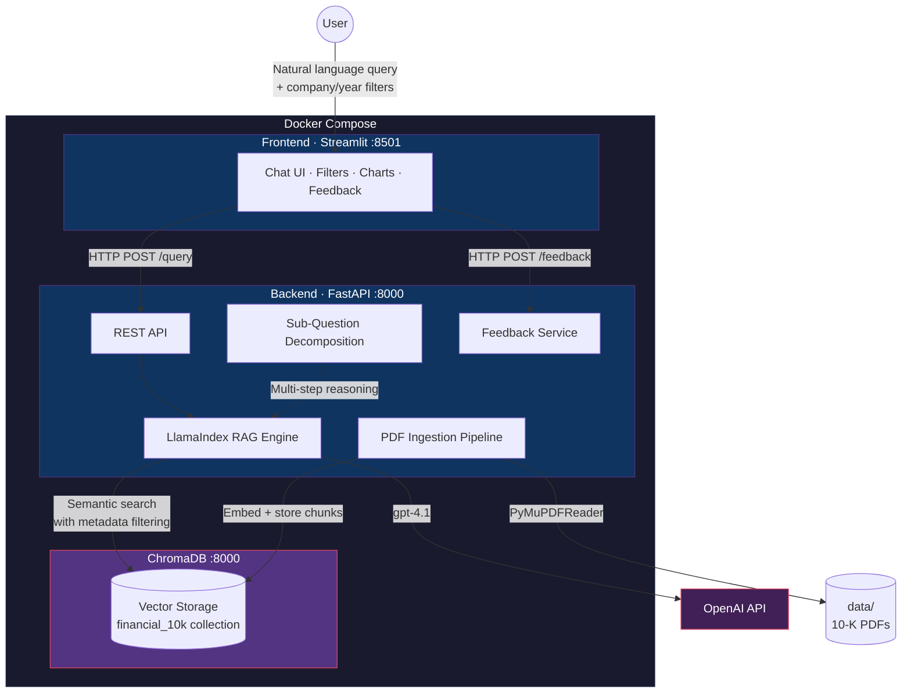

# PageIndex RAG — 10-K Financial Document Analysis

## What This Project Does

Financial analysts spend hours manually searching through SEC 10-K filings — documents that routinely exceed 200 pages — to extract revenue figures, risk factors, segment breakdowns, and year-over-year comparisons. The information is buried across disparate sections, inconsistent formatting, and legal boilerplate.

**PageIndex RAG** is a Retrieval-Augmented Generation (RAG) system that solves this problem. It ingests 10-K annual reports from major public companies (NVIDIA, Alphabet/Google, Apple), indexes them at page-level granularity, and answers natural-language financial questions with **grounded, source-cited, explainable responses**.

The system provides intelligent retrieval with metadata filtering, explainable responses with source citations, multi-step reasoning for comparative queries, and a feedback loop for continuous improvement.

Built for **Netcompany Hackathon Thessaloniki 2026** — Challenge 2: AI-Powered Knowledge Base.

---

## Architecture



## Key Features

- **Intelligent Retrieval** — semantic vector search with metadata filtering by company and fiscal year
- **Explainable Responses** — every answer includes source citations (filename, page number, relevance score, text snippet)
- **Multi-Step Reasoning** — sub-question decomposition for comparative queries (e.g. *"Compare NVIDIA vs Google revenue"*)
- **Financial Visualization** — automatic table and bar chart rendering when responses contain numerical data
- **API Usage Tracking** — token counts and estimated cost via `/usage`; budget enforcement (HTTP 429 when exhausted)
- **User Feedback** — thumbs up/down on every response for continuous improvement signals
- **Graceful Degradation** — MockLLM/MockEmbedding fallback when no OpenAI API key is configured
- **Input Validation** — question length (1–2000 chars), filter list limits; CORS restricted to known frontend origins

---

## How to Run the Project

### Prerequisites

- [Docker Desktop](https://www.docker.com/products/docker-desktop/) installed and running
- An OpenAI API key (provided by hackathon organizers)

Verify Docker is available:

```bash
docker --version
docker compose version
```

### 1. Clone the repository

```bash
git clone <repo-url>
cd Hackathon-RAG
```

### 2. Create the `.env` file

Create a `.env` file in the project root:

```
OPENAI_API_KEY=sk-your-key-here
```

> The `.env` file is gitignored and never committed. Each team member creates it locally.

### 3. Start the system

```bash
docker compose up --build
```

The first build downloads base images and installs dependencies (3–5 minutes). Subsequent starts are faster.

### 3a. Clean rebuild and faster subsequent builds (Windows PowerShell)

Use this when you want to clear the project images and measure build performance on Windows:

```powershell
cd C:\Python\Hackathon-RAG
$env:DOCKER_BUILDKIT = "1"
$env:COMPOSE_DOCKER_CLI_BUILD = "1"

# 1) One true cold build (no cache)
docker compose build --no-cache   # measure this once

# 2) Cached builds (typical workflow)
docker compose build              # measure
docker compose build              # measure again
```

- **First clean run**: use the `--no-cache` command once to get a baseline for a full cold build.
- **Following runs**: use the regular `docker compose build` commands (with cache) for much faster rebuilds during development.

### 4. Verify all services

| Service | URL | Expected |
|---------|-----|----------|
| Backend | http://localhost:8000 | `{"message": "Financial RAG Backend is running"}` |
| Frontend | http://localhost:8501 | Streamlit Chat UI |
| ChromaDB | http://localhost:8100 | ChromaDB API root |

### 5. Ingest the documents

Before querying, you need to ingest the 10-K documents. You can do this in either of two ways:

- **Streamlit UI** — Open http://localhost:8501 and click **Ingest Documents** in the sidebar. This processes all 6 PDFs, creates ~800 chunks with metadata, generates embeddings, and stores them in ChromaDB.
- **Ingest API** — Trigger the ingestion pipeline via `POST http://localhost:8000/ingest` (e.g. using a REST client like Postman, or from your own script).

Ingestion takes 2–5 minutes depending on hardware.

### 6. Start asking questions

Open http://localhost:8501 and use the chat interface. Use the sidebar filters to narrow results by company and year. Enable **Sub-question decomposition** for complex comparative queries.

### Stopping the system

Press **Ctrl+C** in the terminal, or run:

```bash
docker compose down
```

Data persists in the `chroma_data` Docker volume across restarts. To fully reset:

```bash
docker compose down -v
```

---

## Sample Questions to Try

### Simple questions

- *What was NVIDIA's total revenue in fiscal year 2024?*
- *What are the main risk factors mentioned in NVIDIA's 10-K?*
- *How many employees does Apple have?*

### Complex questions (enable Sub-question decomposition)

- *Compare Apple and Google's net income for 2025.*
- *How did Alphabet's advertising revenue change between 2024 and 2025?*
- *Compare NVIDIA and Google total revenue for 2024 and 2025.*
- *Which company had higher R&D spend in 2024: NVIDIA or Alphabet?*
- *How did Apple's net income change from 2024 to 2025?*

---

## How It Works

### Ingestion Pipeline

```
10-K PDFs (data/nvidia/, data/google/, data/apple/)
        │
        ▼
  PyMuPDFReader — per-page text extraction
        │
        ▼
  SentenceSplitter — chunk_size=1024, overlap=200
        │
        ▼
  Metadata Enrichment — company, year, doc_type, source_file
        │
        ▼
  OpenAI text-embedding-3-small — 1536-dim dense vectors
        │
        ▼
  ChromaDB — persistent storage with metadata index
```

Each PDF page becomes one or more chunks. Every chunk carries metadata (company name, fiscal year, document type, source filename) enabling precise filtered retrieval.

### Query Pipeline

```
User question + optional filters (company, year)
        │
        ▼
  Metadata Filter Construction — FilterOperator.IN + FilterCondition.AND
        │
        ▼
  Semantic Retrieval — top-5 chunks from ChromaDB
        │
        ▼
  (Optional) Sub-Question Decomposition — breaks complex queries into sub-questions
        │
        ▼
  LLM Synthesis (gpt-4.1) — grounded answer from retrieved context only
        │
        ▼
  Structured Response — answer + source citations (filename, page, score, snippet)
```

---

## Tech Stack

| Layer | Technology | Role |
|-------|-----------|------|
| Backend | Python 3.12 + FastAPI | Async REST API |
| RAG Framework | LlamaIndex | Document ingestion, chunking, retrieval, synthesis |
| LLM | OpenAI `gpt-4.1` | Answer generation from retrieved context |
| Embeddings | OpenAI `text-embedding-3-small` | Dense vector generation (1536 dims) |
| Vector Database | ChromaDB | Persistent vector storage with metadata index |
| PDF Parsing | PyMuPDF (`pymupdf`) | Page-level text extraction |
| Frontend | Streamlit | Chat interface with filters, citations, charts |
| Feedback Storage | SQLite | Zero-config feedback persistence |
| Containerization | Docker Compose | Three-service orchestration |

## Data Corpus

Six 10-K annual reports from SEC EDGAR, covering three companies across two fiscal years:

| Company | FY 2024 | FY 2025 |
|---------|---------|---------|
| NVIDIA | `nvidia_2024.pdf` | `nvidia_2025.pdf` |
| Alphabet (Google) | `google-2024.pdf` | `google_2025.pdf` |
| Apple | `apple_2024.pdf` | `apple_2025.pdf` |

All documents are publicly available and committed in the `data/` directory.

---

## API Reference

| Method | Path | Description |
|--------|------|-------------|
| `GET` | `/` | Health message |
| `GET` | `/health` | Health check |
| `GET` | `/usage` | API token usage and estimated cost |
| `POST` | `/query` | Execute a RAG query (429 if budget exhausted; 422 if validation fails) |
| `POST` | `/ingest` | Trigger document ingestion (returns `already_running` if concurrent) |
| `POST` | `/feedback` | Submit user feedback on a response |
| `POST` | `/shutdown` | Persist data before stopping containers |

For full request/response schemas and additional endpoints (`/feedback/stats`, `/feedback/recent`), see [Project_Specification.md §6](Project_Specification.md#6-api-contract).

---

## Environment Variables

| Variable | Default | Description |
|----------|---------|-------------|
| `OPENAI_API_KEY` | `""` | OpenAI API key. Without a valid `sk-` key, the system falls back to MockLLM/MockEmbedding. |
| `CHROMA_HOST` | `localhost` | ChromaDB hostname. Set to `chromadb` inside Docker. |
| `CHROMA_PORT` | `8100` | ChromaDB port. Set to `8000` inside Docker (internal port). |
| `DATA_DIR` | (auto-detected) | Path to the `data/` directory containing 10-K PDFs. Set to `/app/data` in Docker. |
| `FEEDBACK_DB_DIR` | `feedback_data/` | Path for SQLite feedback DB and token usage JSON. Set to `/app/feedback_data` in Docker. |
| `BACKEND_URL` | `http://localhost:8000` | Backend URL used by the Streamlit frontend. Set to `http://backend:8000` in Docker. |

All environment variables are configured automatically in `docker-compose.yml`. The only manual step is creating the `.env` file with your OpenAI API key.

For the full project structure, see [Project_Specification.md §10](Project_Specification.md#10-project-structure).

## Docker Services

| Service | Image | Ports | Purpose |
|---------|-------|-------|---------|
| `backend` | Build: `./backend` (python:3.12-slim) | 8000:8000 | FastAPI REST API + RAG engine |
| `frontend` | Build: `./frontend` (python:3.12-slim) | 8501:8501 | Streamlit chat interface |
| `chromadb` | `chromadb/chroma:1.5.2` | 8100:8000 | Persistent vector database |

All services communicate over an internal Docker network. ChromaDB data persists in the `chroma_data` named volume.

---

## Testing

The backend includes a comprehensive test suite (242 tests) built with **pytest**. Tests run locally without Docker, ChromaDB, or an OpenAI API key — all external dependencies are mocked.

### Run all tests

```bash
cd backend
python -m pytest tests/ -v --tb=short
```

### Run specific test categories

```bash
# Smoke tests — health, root, usage, shutdown
python -m pytest tests/test_health.py -v

# Schema validation — all Pydantic models
python -m pytest tests/test_schemas.py -v

# Query router — API key guard, budget, error handling
python -m pytest tests/test_query_router.py -v

# Ingestion — ingest endpoint + metadata extraction
python -m pytest tests/test_ingest_router.py -v

# Feedback — POST/GET feedback endpoints
python -m pytest tests/test_feedback_router.py -v

# RAG engine — filter building, response formatting
python -m pytest tests/test_rag_engine.py -v

# Edge cases — null inputs, type mismatches, malformed data
python -m pytest tests/test_edge_cases.py -v

# E2E integration — real PDF loading, full API flow, contract compliance
python -m pytest tests/test_e2e_integration.py -v

# Performance — 15-second latency enforcement (NFR-05)
python -m pytest tests/test_performance.py -v
```

### Test coverage summary

| Category | File | Tests | What it covers |
|----------|------|-------|----------------|
| Smoke | `test_health.py` | 14 | `/`, `/health`, `/usage`, `/shutdown`, 404s |
| Schemas | `test_schemas.py` | 43 | All 9 Pydantic models: boundaries, nulls, types, round-trips |
| Query | `test_query_router.py` | 53 | API-key guard, budget, mock detection, OpenAI errors, success |
| Ingest | `test_ingest_router.py` | 19 | Ingest success/skip/lock, error paths, metadata extraction |
| Feedback | `test_feedback_router.py` | 17 | Submit, validate, stats, recent, persistence failure |
| RAG Engine | `test_rag_engine.py` | 18 | Filter building, response formatting, score rounding |
| Edge Cases | `test_edge_cases.py` | 44 | Malformed JSON, type coercion, filter passthrough, Unicode |
| E2E | `test_e2e_integration.py` | 25 | Real PDF parsing, chunking, full flow, contract compliance |
| Performance | `test_performance.py` | 9 | Hard 15s latency limit, simulated delays, endpoint speed |

For detailed test descriptions, audit findings, and the full testing methodology, see [Project_Specification.md §13](Project_Specification.md#13-testing).

---

## License

Built for Netcompany Hackathon Thessaloniki 2026. All 10-K documents sourced from [SEC EDGAR](https://www.sec.gov/cgi-bin/browse-edgar?action=getcompany) (public domain).
