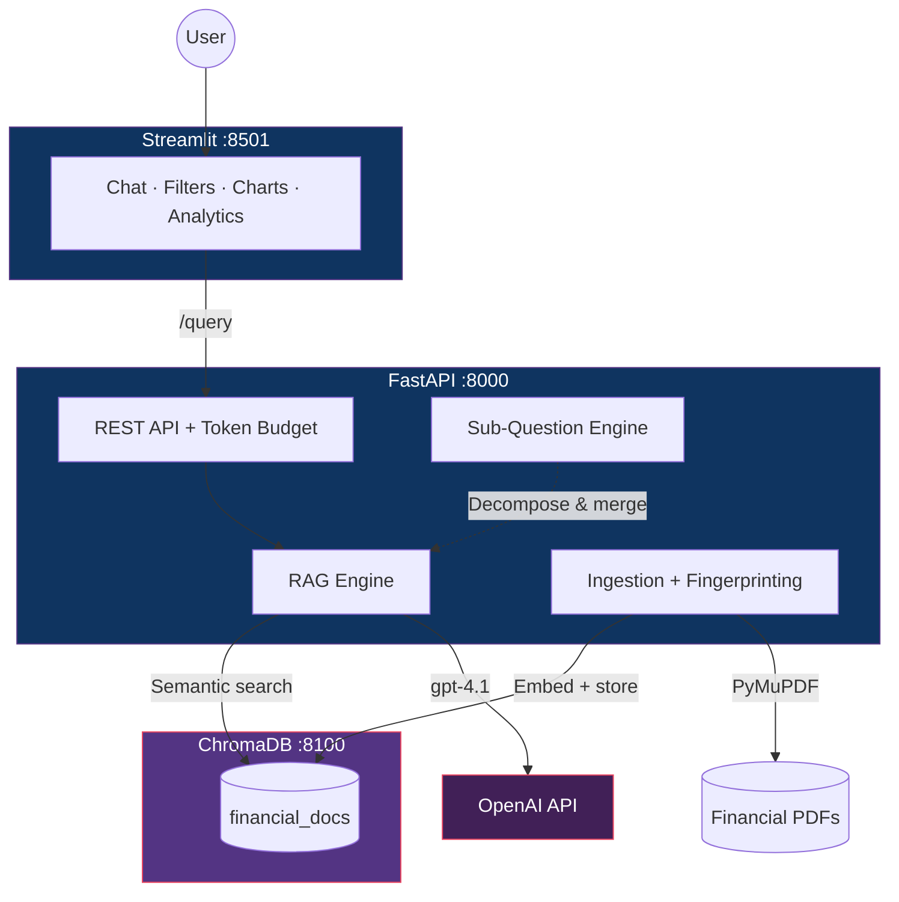
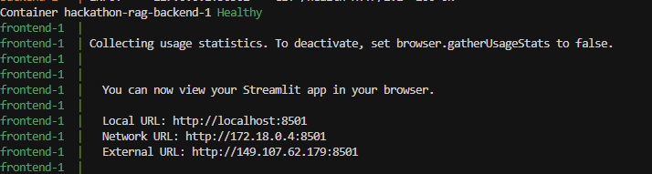

# Lexio — PageIndex RAG for Financial Document Analysis

**[▶ Watch Demo](https://www.youtube.com/watch?v=3dVU70Uv_Ko)**

## What This Project Does

Financial analysts spend hours manually searching through financial documents — SEC filings, annual reports, and similar materials that routinely exceed hundreds of pages — to extract revenue figures, risk factors, segment breakdowns, and year-over-year comparisons. The information is buried across disparate sections, inconsistent formatting, and legal boilerplate.

**Lexio** is a **PageIndex RAG** — a Retrieval-Augmented Generation system for financial documents that indexes and cites at **page-level granularity**. Unlike typical RAG systems that chunk by fixed token windows (e.g., 512 tokens) and often cite vague "document X" references, PageIndex RAG keeps every chunk tied to its source page. Each answer includes **exact page numbers** (e.g., *"NVIDIA Annual Report 2024, page 42"*), so analysts can open the PDF and jump straight to the cited location instead of hunting through hundreds of pages.

Lexio ingests financial PDFs and answers natural-language financial questions with **grounded, source-cited, explainable responses**. Instead of sifting through thousands of pages, analysts simply ask a question — *"Compare NVIDIA and Google revenue for 2024 and 2025"* — and receive a structured answer with exact page references, relevance scores, and automatic data visualizations. Complex comparative queries are decomposed into sub-questions behind the scenes, each resolved independently and merged into a coherent response.

The system provides intelligent retrieval with metadata filtering, explainable responses with source citations, and multi-step reasoning for comparative queries.

Built for **Netcompany Hackathon Thessaloniki 2026** — Challenge 2: AI-Powered Knowledge Base.

For a deeper dive into how this MVP scales into an enterprise-ready product—including Excel integrations, multi-page table resolution, and on-premise data compliance—please read our [Vision & Project Roadmap](Project_Roadmap.md).

---

## Architecture




---

## Key Features

- **Intelligent Retrieval** — semantic vector search with metadata filtering by company, fiscal year, and document type
- **Explainable Responses** — every answer includes source citations with filename, page number, relevance score, and text snippet
- **Multi-Step Reasoning** — sub-question decomposition automatically breaks comparative queries into independent sub-questions, resolves each, and merges the results (e.g. *"Compare NVIDIA vs Google revenue"*)
- **Financial Visualization** — automatic table extraction and bar chart rendering when responses contain numerical data
- **Token Usage & Budget** — real-time token tracking (prompt, completion, embedding) with estimated cost and a $10 budget cap (HTTP 429 when exhausted)
- **Smart Re-ingestion** — an MD5 corpus fingerprint detects added, removed, or renamed PDFs and triggers automatic re-ingestion without manual intervention
- **Auto-ingestion on Startup** — documents are loaded automatically when the backend starts; the UI shows a status banner until indexing completes
- **Graceful Degradation** — MockLLM / MockEmbedding fallback when no OpenAI API key is configured, so the system runs anywhere
- **Input Validation** — question length (1–2 000 chars), filter list limits (max 10); CORS restricted to known frontend origins

---

## How to Run

### Prerequisites

- [Docker Desktop](https://www.docker.com/products/docker-desktop/) installed and running
- An OpenAI API key

### 1. Clone and configure

```bash
git clone <repo-url>
cd Hackathon-RAG
```

Create a `.env` file in the project root with your API key:

```
OPENAI_API_KEY=sk-your-key-here
```

### 2. Start the system

```bash
docker compose up --build
```

That's it — all three services (backend, frontend, vector database) start automatically.

### 3. Open the app

Wait for the frontend to appear in the terminal. When you see output like this, the app is ready:

<p align="center">
  
</p>

Then open **`http://localhost:8501`** in your browser.

| Service  | URL                     |
| -------- | ----------------------- |
| Frontend | `http://localhost:8501` |
| Backend  | `http://localhost:8000` |
| ChromaDB | `http://localhost:8100` |


On first launch, the backend automatically ingests all 15 PDFs in the background. A banner in the UI shows progress — you can start chatting immediately and results improve once indexing completes.

### 4. Stop the system

```bash
docker compose down
```

Or, to also remove volumes (ChromaDB data and app data):

```bash
docker compose down -v
```

> **Tip (Windows/PowerShell):** Speed up subsequent builds by enabling BuildKit:
>
> ```powershell
> $env:DOCKER_BUILDKIT = "1"
> $env:COMPOSE_DOCKER_CLI_BUILD = "1"
> ```

---

## Sample Questions to Try

### Simple questions

- *What was NVIDIA's total revenue in fiscal year 2024?*
- *What are the main risk factors mentioned in NVIDIA's annual report?*
- *How did Apple's net income change from 2024 to 2025?*
- *Which company had higher R&D spend in 2024: NVIDIA or Alphabet?*

### Complex questions (multi-step reasoning)

- *Compare Apple and Microsoft from 2023 through 2025 on net income and operating margin. Determine which company shows more consistent profitability improvement over the period (define consistency using the observed year‑to‑year movements), and cite the specific 10‑K explanations for the main drivers behind the margin/net income changes in each year.*  

- *From 2023 to 2025, track Alphabet (Google) advertising revenue and Microsoft cloud revenue (use the segment names as reported). Compute the percentage growth over 2023→2025 for each segment, determine which segment grew faster, and summarize the drivers each company attributes the growth (or slowdown) to, citing the relevant 10‑K passages across multiple years.*  

- *Using Tesla and NVIDIA 10‑Ks for 2024 and 2025, identify three risk factor themes that are present in both companies (e.g., supply chain, regulatory, competition—use the exact themes you find). For each theme, compare how the emphasis changed from 2024 to 2025 within each company (what got stronger/weaker or newly highlighted), and support with citations from both years.*  

- *Compare total revenue for NVIDIA, Microsoft, and Alphabet (Google) across 2023, 2024, and 2025. For each company, compute YoY growth for 2023→2024 and 2024→2025, identify which year had the higher YoY growth, and cite the specific driver(s) each company attributes that change to in its 10‑K.*

---

## How It Works

1. **Ingestion** — Financial PDFs are parsed page-by-page with PyMuPDF. Each page becomes one indexed unit (no token splitting), tagged with metadata (company, year, document type, source file). Pages exceeding 8 191 tokens are truncated for embedding-model compatibility.
2. **Embedding** — Each page is embedded using OpenAI `text-embedding-3-small` and stored in ChromaDB.
3. **Retrieval** — When you ask a question, the most relevant pages are retrieved via semantic similarity search with optional metadata filters.
4. **Synthesis** — The LLM (GPT-4.1) answers using only the retrieved context and returns citations (file + page).
5. **Sub-questions** — For comparative queries, the system decomposes the question into independent sub-questions, resolves each separately, and merges the answers.

---

## Tech Stack


| Layer            | Technology                      | Role                                               |
| ---------------- | ------------------------------- | -------------------------------------------------- |
| Backend          | Python 3.12 + FastAPI           | Async REST API                                     |
| RAG Framework    | LlamaIndex                      | Document ingestion, chunking, retrieval, synthesis |
| LLM              | OpenAI `gpt-4.1`                | Answer generation from retrieved context           |
| Embeddings       | OpenAI `text-embedding-3-small` | Dense vector generation (1 536 dims)               |
| Vector Database  | ChromaDB                        | Persistent vector storage with metadata index      |
| PDF Parsing      | PyMuPDF (`pymupdf`)             | Page-level text extraction                         |
| Frontend         | Streamlit                       | Chat interface with filters, citations, charts     |
| Containerization | Docker Compose                  | Three-service orchestration                        |


---

## Data Corpus

Lexio is designed for financial documents in general (SEC filings, annual reports, prospectuses, etc.). The current demo corpus uses **15 10-K annual reports** from SEC EDGAR — limited to this subset for hackathon constraints (time and resources). You can add other financial PDFs to `data/` and re-ingest.

**Current demo corpus** — five companies across three fiscal years:


| Company           | FY 2023        | FY 2024        | FY 2025        |
| ----------------- | -------------- | -------------- | -------------- |
| NVIDIA            | `10k_2023.pdf` | `10k_2024.pdf` | `10k_2025.pdf` |
| Alphabet (Google) | `10k_2023.pdf` | `10k_2024.pdf` | `10k_2025.pdf` |
| Apple             | `10k_2023.pdf` | `10k_2024.pdf` | `10k_2025.pdf` |
| Microsoft         | `10k_2023.pdf` | `10k_2024.pdf` | `10k_2025.pdf` |
| Tesla             | `10k_2023.pdf` | `10k_2024.pdf` | `10k_2025.pdf` |


All documents are publicly available and stored in the `data/` directory, organized by company subdirectory.

---

## API Reference


| Method | Path             | Description                                                            |
| ------ | ---------------- | ---------------------------------------------------------------------- |
| `GET`  | `/`              | Health message                                                         |
| `GET`  | `/health`        | Health check                                                           |
| `GET`  | `/usage`         | API token usage and estimated cost                                     |
| `GET`  | `/ingest/status` | Auto-ingestion status used by the frontend banner                      |
| `POST` | `/query`         | Execute a RAG query (429 if budget exhausted; 422 if validation fails) |
| `POST` | `/ingest`        | Trigger document ingestion (returns `already_running` if concurrent)   |
| `POST` | `/shutdown`      | Persist data before stopping containers                                |


---

## Environment Variables


| Variable         | Default                 | Description                                                                                |
| ---------------- | ----------------------- | ------------------------------------------------------------------------------------------ |
| `OPENAI_API_KEY` | `""`                    | OpenAI API key. Without a valid `sk-` key, the system falls back to MockLLM/MockEmbedding. |
| `CHROMA_HOST`    | `localhost`             | ChromaDB hostname. Set to `chromadb` inside Docker.                                        |
| `CHROMA_PORT`    | `8100`                  | ChromaDB port. Set to `8000` inside Docker (internal port).                                |
| `DATA_DIR`       | (auto-detected)         | Path to the `data/` directory containing financial PDFs. Set to `/app/data` in Docker.     |
| `APP_DATA_DIR`   | `app_data/`             | Path for token usage persistence and corpus fingerprint. Set to `/app/app_data` in Docker. |
| `BACKEND_URL`    | `http://localhost:8000` | Backend URL used by the Streamlit frontend. Set to `http://backend:8000` in Docker.        |


All environment variables are configured automatically in `docker-compose.yml`. The only manual step is creating the `.env` file with your OpenAI API key.

---

## Docker Services


| Service    | Image                                  | Ports     | Purpose                       |
| ---------- | -------------------------------------- | --------- | ----------------------------- |
| `backend`  | Build: `./backend` (python:3.12-slim)  | 8000:8000 | FastAPI REST API + RAG engine |
| `frontend` | Build: `./frontend` (python:3.12-slim) | 8501:8501 | Streamlit chat interface      |
| `chromadb` | `chromadb/chroma:1.5.2`                | 8100:8000 | Persistent vector database    |


All services communicate over an internal Docker network. ChromaDB data persists in the `chroma_data` named volume. Application data (token usage, corpus fingerprint) persists in the `app_data` named volume.

---

## Testing

The backend includes **203 automated tests** across 8 test files, runnable locally without Docker, ChromaDB, or an OpenAI API key (all external dependencies are mocked).

```bash
cd backend
python -m pytest tests/ -v
```

---

## License

Built for Netcompany Hackathon Thessaloniki 2026. Demo corpus sourced from [SEC EDGAR](https://www.sec.gov/cgi-bin/browse-edgar?action=getcompany) (public domain).
