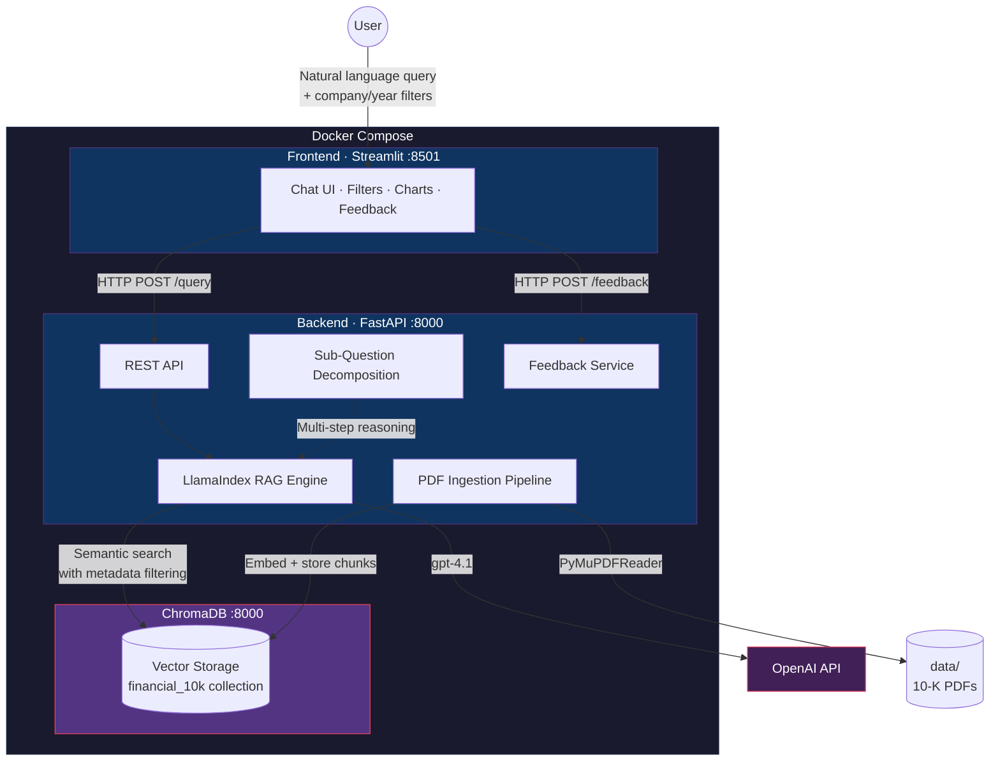

# PageIndex RAG — 10-K Financial Document Analysis

## What This Project Does

Financial analysts spend hours manually searching through SEC 10-K filings — documents that routinely exceed 200 pages — to extract revenue figures, risk factors, segment breakdowns, and year-over-year comparisons. The information is buried across disparate sections, inconsistent formatting, and legal boilerplate.

**PageIndex RAG** is a Retrieval-Augmented Generation (RAG) system that solves this problem. It ingests 10-K annual reports from major public companies (NVIDIA, Alphabet/Google, Apple), indexes them at page-level granularity, and answers natural-language financial questions with **grounded, source-cited, explainable responses**.

The system provides intelligent retrieval with metadata filtering, explainable responses with source citations, multi-step reasoning for comparative queries, and a feedback loop for continuous improvement.

Built for **Netcompany Hackathon Thessaloniki 2026** — Challenge 2: AI-Powered Knowledge Base.

---

## Architecture



## Key Features

- **Intelligent Retrieval** — semantic vector search with metadata filtering by company and fiscal year
- **Explainable Responses** — every answer includes source citations (filename, page number, relevance score, text snippet)
- **Multi-Step Reasoning** — sub-question decomposition for comparative queries (e.g. *"Compare NVIDIA vs Google revenue"*)
- **Financial Visualization** — automatic table and bar chart rendering when responses contain numerical data
- **API Usage Tracking** — token counts and estimated cost via `/usage`; budget enforcement (HTTP 429 when exhausted)
- **User Feedback** — thumbs up/down on every response for continuous improvement signals
- **Graceful Degradation** — MockLLM/MockEmbedding fallback when no OpenAI API key is configured
- **Input Validation** — question length (1–2000 chars), filter list limits; CORS restricted to known frontend origins
 - **Auto-ingestion & status banner** — documents are loaded automatically on backend startup; the UI shows when indexing is still running

---

## How to Run the Project

### 1. Setup & Run

```bash
# Clone the repository
git clone <repo-url>
cd Hackathon-RAG

# Create your .env file
echo "OPENAI_API_KEY=sk-your-key-here" > .env

# Build and start the system
docker compose up --build
```

> **Windows (PowerShell) builds**: To speed up subsequent builds, set once in PowerShell:
> ```powershell
> $env:DOCKER_BUILDKIT = "1"
> $env:COMPOSE_DOCKER_CLI_BUILD = "1"
> ```

### 2. Open the app

- **Frontend**: `http://localhost:8501`
- **Backend health**: `http://localhost:8000`
- **ChromaDB**: `http://localhost:8100`

### 3. Let the index warm up (auto-ingestion)

On backend startup, the 10-K PDFs are ingested automatically in the background:

- The frontend periodically calls `GET /ingest/status` and shows a banner like **"Index warming up — documents are being loaded in the background. You can still use the app."**
- You can start chatting immediately; results improve once indexing has finished and the banner disappears.

### 4. (Optional) Reload documents from the UI

Use this if you change PDFs or want to force a rebuild:

- Open the **Documents** page in the left sidebar.
- (Optional) enable **Force re-ingest** to rebuild even if data already exists.
- Click **Load Documents** to trigger a manual ingest (`POST /ingest`).

---

## Sample Questions to Try

### Simple questions

- *What was NVIDIA's total revenue in fiscal year 2024?*
- *What are the main risk factors mentioned in NVIDIA's 10-K?*
- *How many employees does Apple have?*

### Complex questions (multi-step reasoning is automatic)

- *Compare Apple and Google's net income for 2025.*
- *How did Alphabet's advertising revenue change between 2024 and 2025?*
- *Compare NVIDIA and Google total revenue for 2024 and 2025.*
- *Which company had higher R&D spend in 2024: NVIDIA or Alphabet?*
- *How did Apple's net income change from 2024 to 2025?*

---

## How It Works

At a high level:

1. 10-K PDFs are split into text chunks and tagged with company and year.
2. Each chunk is embedded and stored in ChromaDB.
3. When you ask a question, the most relevant chunks are retrieved.
4. The LLM answers using only the retrieved context and returns citations (file + page).

---

## Tech Stack

| Layer | Technology | Role |
|-------|-----------|------|
| Backend | Python 3.12 + FastAPI | Async REST API |
| RAG Framework | LlamaIndex | Document ingestion, chunking, retrieval, synthesis |
| LLM | OpenAI `gpt-4.1` | Answer generation from retrieved context |
| Embeddings | OpenAI `text-embedding-3-small` | Dense vector generation (1536 dims) |
| Vector Database | ChromaDB | Persistent vector storage with metadata index |
| PDF Parsing | PyMuPDF (`pymupdf`) | Page-level text extraction |
| Frontend | Streamlit | Chat interface with filters, citations, charts |
| Feedback Storage | SQLite | Zero-config feedback persistence |
| Containerization | Docker Compose | Three-service orchestration |

## Data Corpus

Six 10-K annual reports from SEC EDGAR, covering three companies across two fiscal years:

| Company | FY 2024 | FY 2025 |
|---------|---------|---------|
| NVIDIA | `nvidia_2024.pdf` | `nvidia_2025.pdf` |
| Alphabet (Google) | `google-2024.pdf` | `google_2025.pdf` |
| Apple | `apple_2024.pdf` | `apple_2025.pdf` |

All documents are publicly available and committed in the `data/` directory.

---

## API Reference

| Method | Path | Description |
|--------|------|-------------|
| `GET` | `/` | Health message |
| `GET` | `/health` | Health check |
| `GET` | `/usage` | API token usage and estimated cost |
| `GET` | `/ingest/status` | Auto-ingestion status used by the frontend banner |
| `POST` | `/query` | Execute a RAG query (429 if budget exhausted; 422 if validation fails) |
| `POST` | `/ingest` | Trigger document ingestion (returns `already_running` if concurrent) |
| `POST` | `/feedback` | Submit user feedback on a response |
| `POST` | `/shutdown` | Persist data before stopping containers |

For full request/response schemas and additional endpoints (`/feedback/stats`, `/feedback/recent`), see [Project_Specification.md §6](Project_Specification.md#6-api-contract).

---

## Environment Variables

| Variable | Default | Description |
|----------|---------|-------------|
| `OPENAI_API_KEY` | `""` | OpenAI API key. Without a valid `sk-` key, the system falls back to MockLLM/MockEmbedding. |
| `CHROMA_HOST` | `localhost` | ChromaDB hostname. Set to `chromadb` inside Docker. |
| `CHROMA_PORT` | `8100` | ChromaDB port. Set to `8000` inside Docker (internal port). |
| `DATA_DIR` | (auto-detected) | Path to the `data/` directory containing 10-K PDFs. Set to `/app/data` in Docker. |
| `FEEDBACK_DB_DIR` | `feedback_data/` | Path for SQLite feedback DB and token usage JSON. Set to `/app/feedback_data` in Docker. |
| `BACKEND_URL` | `http://localhost:8000` | Backend URL used by the Streamlit frontend. Set to `http://backend:8000` in Docker. |

All environment variables are configured automatically in `docker-compose.yml`. The only manual step is creating the `.env` file with your OpenAI API key.

For the full project structure, see [Project_Specification.md §10](Project_Specification.md#10-project-structure).

## Docker Services

| Service | Image | Ports | Purpose |
|---------|-------|-------|---------|
| `backend` | Build: `./backend` (python:3.12-slim) | 8000:8000 | FastAPI REST API + RAG engine |
| `frontend` | Build: `./frontend` (python:3.12-slim) | 8501:8501 | Streamlit chat interface |
| `chromadb` | `chromadb/chroma:1.5.2` | 8100:8000 | Persistent vector database |

All services communicate over an internal Docker network. ChromaDB data persists in the `chroma_data` named volume.

---

## Testing

The backend includes a pytest test suite.

```bash
cd backend
python -m pytest -v
```

For more detailed test information, see `Project_Specification.md`.

---

## License

Built for Netcompany Hackathon Thessaloniki 2026. All 10-K documents sourced from [SEC EDGAR](https://www.sec.gov/cgi-bin/browse-edgar?action=getcompany) (public domain).
